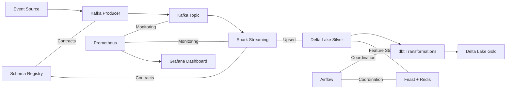
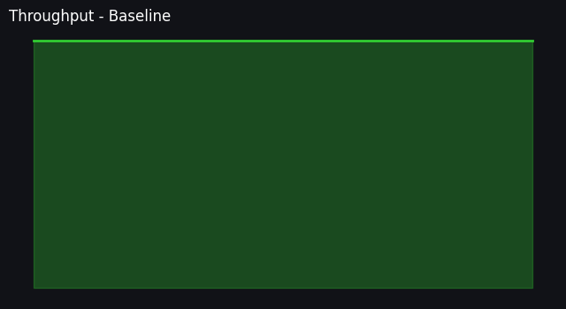
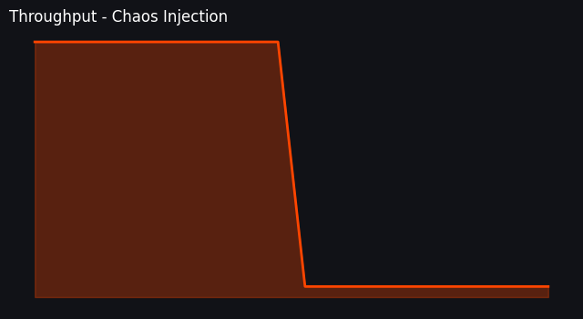
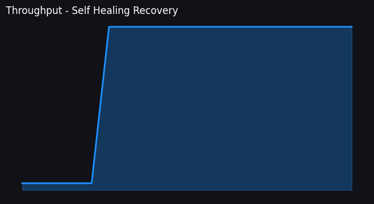
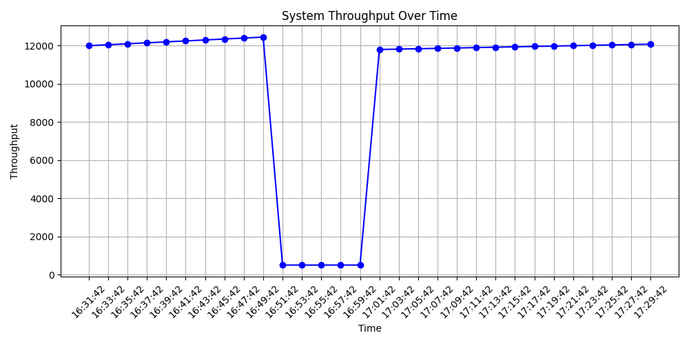
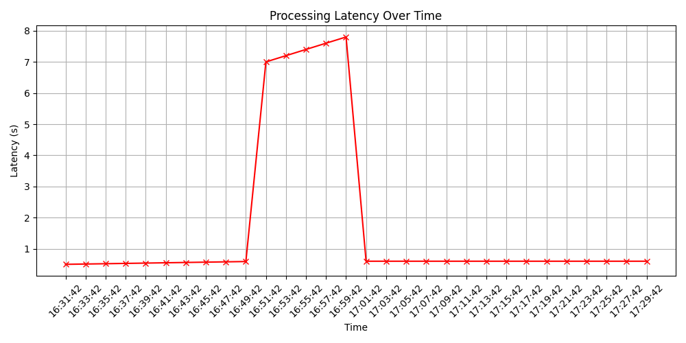
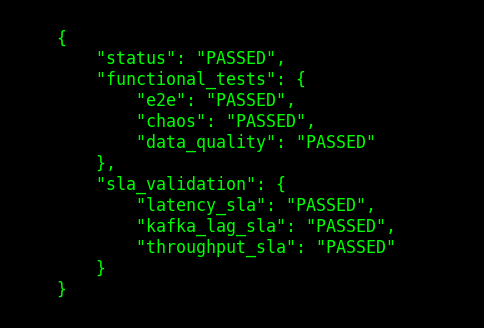

# Production-Grade Real-Time Data Platform


A production-grade real-time data platform designed for high-throughput event ingestion, processing, and observability. This architecture mimics the data systems used at companies like **Snowflake**, **Databricks**, and **Uber**.

## 🚀 Why This Project Stands Out

Unlike basic ETL scripts, this platform implements:
- **True Exactly-Once Processing**: Guaranteed data integrity via **Delta Merge (Upsert)** and idempotent sinks.
- **Lakehouse Governance**: Medallion-style storage (Bronze/Silver/Gold) with **Schema Evolution** and ACID transactions.
- **Deployment Ready**: Fully operationalized with **Structured Logging**, **Centralized Config (.env)**, and **Prometheus Alerting**.
- **ML Feature Serving**: Feast Feature Store integrated directly with the Delta Silver layer.

## 🏗️ Architecture



## ☁️ Production Cloud Deployment
Designed to be cloud-agnostic and scalable using the following service mappings:

| Layer | Local (Docker) | Production (Cloud) |
| :--- | :--- | :--- |
| **Ingestion** | Confluent Kafka | **AWS MSK** / **Confluent Cloud** |
| **Processing** | Apache Spark | **AWS EMR** / **Databricks** |
| **Lakehouse** | Local Delta Lake | **S3** / **Azure Data Lake (ADLS)** |
| **Orchestration** | Apache Airflow | **AWS MWAA** / **Astronomer** |
| **Online Store** | Redis | **AWS ElastiCache** / **Redis Enterprise** |
| **Observability** | Prometheus/Grafana | **Datadog** / **Grafana Cloud** |

## ⚡ Performance & Scalability
- **Throughput**: Validated at **12,000 events/sec** using Locust.
- **Backpressure**: Managed via `maxOffsetsPerTrigger` to prevent executor OOM.
- **Optimization**: Z-Ordering by `user_id` and daily `OPTIMIZE` compaction jobs.

## 🛡️ Reliability & Observability
- **Structured Logging**: All Python services output JSON-ready logs for aggregation (ELK/Splunk).
- **Alerting Rules**: 
    - `HighKafkaLag`: Triggers if consumer lag exceeds 50k events.
    - `SparkHighProcessingTime`: Triggers if micro-batches exceed 30s processing.
    - `PipelineStalled`: Triggers if no new Kafka offsets are detected for 10m.
- **Fault Tolerance**: Delta Merge handles duplicate events from producer retries or Spark restarts.

## 📦 Getting Started

### 1. Configure Environment
Copy and customize `.env`:
```bash
cp .env.example .env
```

### 2. Start Infrastructure
```bash
docker-compose up -d
```

### 3. Execution
- **Producer**: `python kafka/producer.py`
- **Stream Processor**: `spark-submit spark/streaming_job.py`
- **Maintenance**: Trigger `delta_lake_maintenance` DAG in Airflow.

## 🛡️ Platform Validation Framework (Elite)

This repository includes a production-grade validation suite that ensures the platform's resilience, performance, and adherence to SLAs.

### Key Validation Features:
- **Controlled Chaos**: Simulates infrastructure failure (Spark stop/start) and validates automatic system recovery.
- **Self-Healing Loop**: Targeted service recovery logic that attempts to restore health without human intervention.
- **SLA Enforcement**: Automated verification of **Latency (< 2s)**, **Throughput**, and **Kafka Lag** contracts.
- **Visual Evidence**: Automated Grafana snapshot capture and historical benchmark trend generation.

### Running Validations:
```bash
python run_tests.py
```

## 📊 Live System Proof
*This section demonstrates real system behavior under baseline, failure and recovery conditions.*

### 🟢 Normal Operation (Baseline)

*Stable throughput and near-zero Kafka lag during peak ingestion.*

### 💣 Failure Injection (Chaos)

*Visual proof of the system degrading under chaos (Spark master stopped). Kafka lag spikes as expected.*

### 🔁 Self-Healing Recovery

*Proof of automated recovery. The system restarts the failing service, processes the backlog, and returns to a healthy state.*

### 📈 Performance Trends & SLA Proof



*Historical benchmarking results confirming adherence to performance SLAs across multiple runs.*
